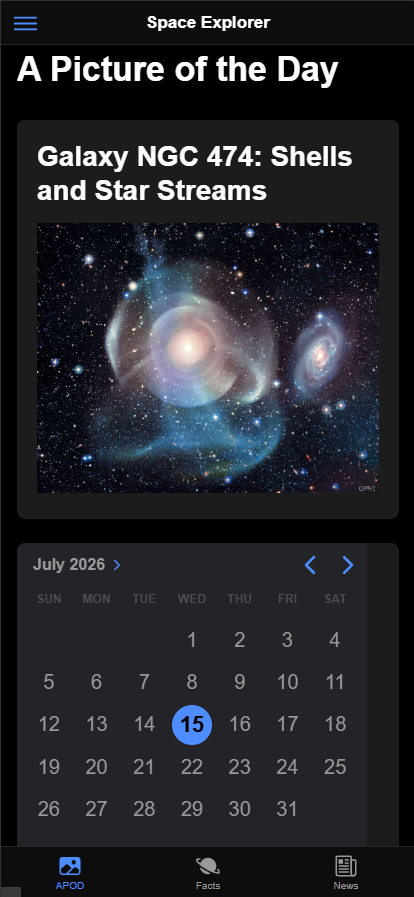
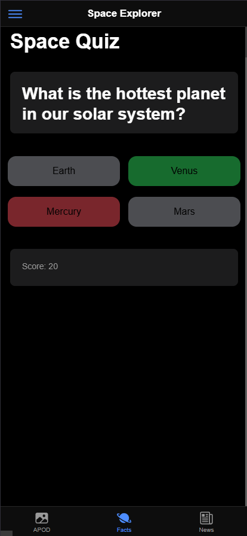
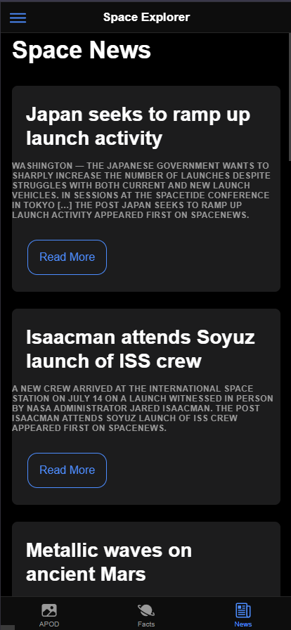
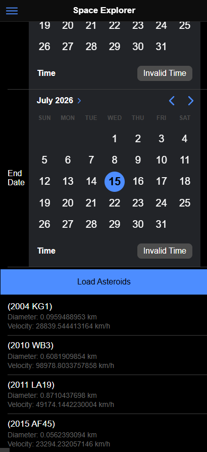
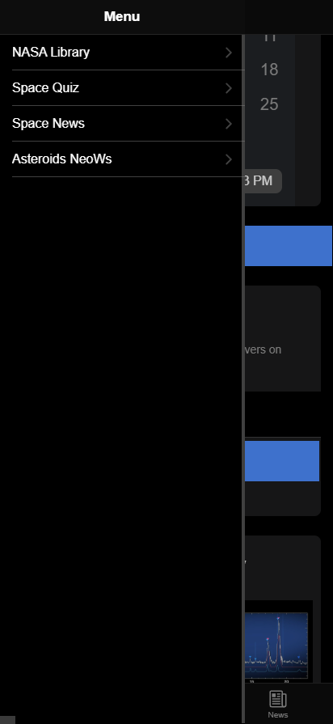

<div align="center">

# 🌌 AstroSphere

A cross-platform mobile application for space enthusiasts, built with **Ionic, Angular, Capacitor, and TypeScript**.

AstroSphere brings together NASA imagery, Mars rover photography, astronomy news, near-Earth asteroid data, and an interactive space quiz in one mobile-friendly application.


</div>

---

## About the project

AstroSphere is a mobile application created as the final project for the **AP5PM** course.

The application is organized into four main tabs:

- space imagery,
- a space knowledge quiz,
- space news,
- near-Earth asteroid information.

It uses a combination of external APIs and locally stored data to provide an educational and interactive experience for users interested in astronomy and space exploration.

---

## Screenshots

<p align="center">
  
  
  
  
  
</p>

---

## Features

### Space imagery

- View NASA's Astronomy Picture of the Day
- Load the picture for a selected date
- Browse photographs captured by Mars rovers
- Search Mars photographs by Martian sol
- Display random media from the NASA Image and Video Library
- Automatically refresh selected NASA media

### Space quiz

- Answer ten astronomy and space-related questions
- Receive immediate answer feedback
- Earn points for correct answers
- View the final score
- Restart the quiz
- Preserve quiz progress in local storage

### Space news

- Browse recent articles about space exploration and astronomy
- View article titles, publication dates, and summaries
- Open the original article to continue reading
- Display a fallback message when no articles are available

### Asteroid browser

- Select a start and end date
- Load near-Earth asteroid data
- View asteroid names
- See estimated maximum diameter
- See relative approach velocity

---

## Technology stack

| Area | Technology |
|---|---|
| Mobile UI | Ionic 8 |
| Frontend framework | Angular 19 |
| Language | TypeScript |
| Native runtime | Capacitor 7 |
| Styling | SCSS |
| Reactive programming | RxJS |
| Android integration | Capacitor Android |
| Testing | Jasmine and Karma |
| Linting | ESLint |

---

## Data sources

The application uses public space-related APIs, including:

- NASA Astronomy Picture of the Day
- NASA Mars Rover Photos
- NASA Image and Video Library
- NASA Near Earth Object data
- Spaceflight News API

Some NASA endpoints may require an API key depending on their configuration.


---

## Project structure

```text
AstroSphere-Vol2/
├── android/                     # Native Android Capacitor project
├── resources/                   # Application icons and splash resources
├── src/
│   ├── app/
│   │   ├── services/            # API and local-storage services
│   │   ├── tab1/                # NASA imagery and Mars photos
│   │   ├── tab2/                # Space quiz
│   │   ├── tab3/                # Space news
│   │   ├── tab4/                # Near-Earth asteroids
│   │   ├── tabs/                # Tab navigation
│   │   └── app-routing.module.ts
│   ├── assets/
│   ├── theme/
│   ├── global.scss
│   └── index.html
├── angular.json
├── capacitor.config.ts
├── ionic.config.json
├── package.json
└── README.md
```

---

## Getting started

### Prerequisites

Install:

- [Node.js](https://nodejs.org/)
- npm
- [Ionic CLI](https://ionicframework.com/docs/cli)
- Android Studio for Android builds
- Git

Install the Ionic CLI globally:

```bash
npm install -g @ionic/cli
```

---

## 1. Clone the repository

```bash
git clone https://github.com/apolkova/AstroSphere-Vol2.git
cd AstroSphere-Vol2
```

---

## 2. Install dependencies

```bash
npm install
```

---

## 3. Run in the browser

```bash
ionic serve
```

The development server will open the application in your browser.

You can also use:

```bash
npm start
```

---

## 4. Build the web application

```bash
npm run build
```

---

## 📲 Running on Android

Build the application:

```bash
ionic build
```

Synchronize the web application with the Android project:

```bash
npx cap sync android
```

Open the Android project:

```bash
npx cap open android
```

Then run the application from Android Studio using an emulator or connected Android device.

After making web-code changes, run:

```bash
ionic build
npx cap sync android
```

---

## Running tests

Run the Angular unit tests:

```bash
npm test
```

Run linting:

```bash
npm run lint
```

---

## Application navigation

AstroSphere uses bottom-tab navigation with four sections:

| Tab | Content |
|---|---|
| Tab 1 | NASA picture of the day, Mars photos, and NASA media |
| Tab 2 | Interactive space quiz |
| Tab 3 | Space news |
| Tab 4 | Near-Earth asteroid search |

---

## Local storage

The quiz stores the current score and question position locally.

This allows users to leave the quiz and continue later without immediately losing their progress. The stored progress is cleared when the quiz is completed or restarted.

---

## Author

Developed by [apolkova](https://github.com/apolkova) as the final project for the **AP5PM** course on TBU.